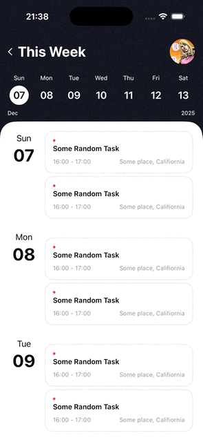
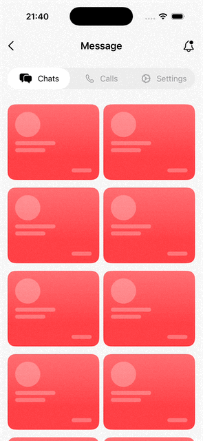
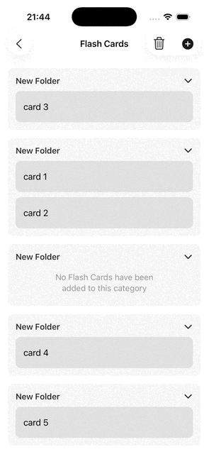
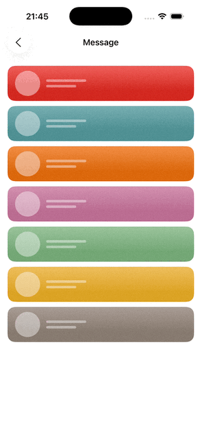
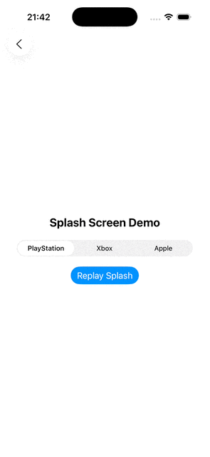

# MyDemo - SwiftUI UI Demo Collection

A collection of SwiftUI UI technique demos for exploring and implementing modern iOS APIs.

**Target:** iOS 17.0+

## Demos

### Task Manager
A weekly task management interface with calendar navigation and smooth animations.

**Key Techniques:**
- Scroll position binding with bidirectional sync
- `matchedGeometryEffect` for seamless transitions
- Weekly calendar UI with date selection
- Custom task list with grouped sections



---

### Waterfall Grid
Pinterest-style masonry layout for displaying images with varying heights.

**Key Techniques:**
- Custom `WaterfallGrid` layout implementation
- Dynamic column distribution based on item heights
- Pull-to-refresh with `refreshable`
- Spring animations for shuffle effect


---

### Expandable Header
Collapsible header component with smooth expand/collapse animations.

**Key Techniques:**
- Dynamic header height calculation
- Gesture-driven expand/collapse
- `@Namespace` for animation coordination
- Customizable expanded content area


---

### Scrollable Tab View
Horizontally scrollable tab bar with synchronized content paging.

**Key Techniques:**
- Tab indicator position tracking via `tabProgress`
- Bidirectional sync between tab bar and scroll content
- `containerRelativeFrame` for page sizing
- Smooth indicator animation



---

### Infinite ScrollView
Seamless infinite horizontal scrolling with automatic content duplication.

**Key Techniques:**
- Dynamic content duplication for infinite loop
- `UIScrollViewDelegate` integration via `UIViewRepresentable`
- Deceleration rate customization
- Content size calculation and adjustment


---

### Movable Cards with CoreData
Draggable card system with persistent storage using CoreData.

**Key Techniques:**
- Long-press gesture for drag initiation
- CoreData integration with `@FetchRequest`
- Category-based card organization with `DisclosureGroup`
- Scroll position management during drag
- Drop zone detection with visual feedback



---

### Custom Swipe Actions
Fully customizable swipe-to-reveal action buttons.

**Key Techniques:**
- Horizontal `ScrollView` with snap behavior
- `ScrollViewReader` for programmatic scrolling
- Bidirectional swipe support (leading/trailing)
- Custom action button builder with `@resultBuilder`
- Background color transition based on scroll offset



---

### Paywall-StoreKit
Modern subscription paywall UI integrated with StoreKit 2.

**Key Techniques:**
- `storeProductsTask` for product loading
- `SubscriptionStoreView` with custom marketing content
- Animated gradient title using `textRenderer`
- App Store screenshot carousel
- Terms and policy links integration


---

### SplashScreen
Customizable app launch screen with logo animation.

**Key Techniques:**
- Custom `LaunchScreen` view wrapper
- Logo fade-in animation sequence
- Configurable logo image support
- Replay functionality for demo purposes



---

## Project Structure

```
MyDemo/
├── App/              # Application entry point
├── Demo/             # Feature demos
│   ├── Custom Swipe Actions/
│   ├── Expandable Header/
│   ├── Infinite ScrollView/
│   ├── Movable Cards with CoreData/
│   ├── Paywall-StoreKit/
│   ├── Scrollable Tab View/
│   ├── SplashScreen/
│   ├── TaskManager/
│   └── Waterfall Grid/
├── Resources/        # Assets and resources
└── Sample/           # Quick experiments
```

## Requirements

- iOS 17.0+
- Xcode 15.0+
- Swift 5.9+

## Usage

Each demo is self-contained and can be navigated from the main `ContentView`. Simply tap on any demo to explore its implementation.

## License

This project is for educational and demonstration purposes.
